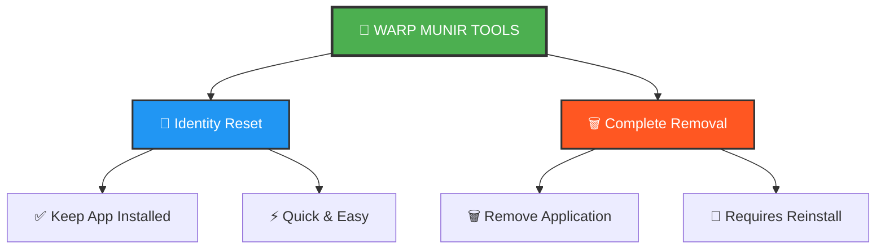

# 🚀 Warp Bypass - Identity Reset & Complete Removal Tools

<div align="center">

<!-- Main Stats -->


[](https://github.com/black12-ag/warp-bypass)


<!-- Platform Support -->


**Cross-platform Python tools for Warp terminal: Reset machine identity OR completely remove the app**

</div>

---

## 🎯 What is This?

**Warp Bypass** provides two tools to reset your Warp terminal identity:

- **🔄 Identity Reset** - Keeps app installed, resets machine identity
- **🗑️ Complete Removal** - Completely removes app and all traces

## 📊 Tools Comparison

<div align="center">



```
```

</div>

| Feature | 🔄 Identity Reset | 🗑️ Complete Removal |
|---------|------------------|---------------------|
| **🏗️ App Installation** | ✅ **Preserved** | ❌ **Removed** |
| **⚡ Speed** | 🚀 **Fast** (30-60 sec) | 🐌 **Moderate** (2-5 min) |
| **📱 Ready to Use** | ✅ **Immediately** | ⬇️ **After Reinstall** |
| **🎯 Best For** | 🔧 **Quick Fix** | 🆕 **Fresh Start** |

## 🚀 Quick Start

### Prerequisites
- Python 3.6+ (pre-installed on macOS/Linux)
- Administrator/Root privileges
- **Close all browsers before running** (Chrome, Firefox, Brave, etc.)

### 📝 Step-by-Step Guide

#### **Step 1: Clone Repository**
```bash
git clone https://github.com/black12-ag/warp-bypass.git
cd warp-bypass
```

**🪟 Windows:** Open PowerShell/CMD as Administrator
**🍎 macOS/🐧 Linux:** Open Terminal with sudo access

#### **Step 2: Choose Your Tool**

### 🪟 Windows Users

**🔴 IMPORTANT: Run PowerShell or CMD as Administrator**
- Right-click on PowerShell/CMD
- Select "Run as Administrator"

 **Option A: 🔄 Identity Reset (Recommended)**
```powershell
# Windows - Run as Administrator
python warp_id_reset.py
```
 **Option B: 🗑️ Complete Removal**
```powershell
# Windows - Run as Administrator
python warp_remover.py
```
- ✅ Keeps Warp installed
- ✅ Resets machine identity  
- ✅ Ready to use immediately

- ❌ Removes Warp completely
- ✅ Clean slate for reinstall
- ⚠️ Need to reinstall Warp after

---

### 🍎 macOS / 🐧 Linux Users

**Option A: 🔄 Identity Reset (Recommended)**
```bash
# macOS/Linux - Run with sudo
sudo python3 warp_id_reset.py
```
- ✅ Keeps Warp installed
- ✅ Resets machine identity
- ✅ Ready to use immediately

**Option B: 🗑️ Complete Removal**
```bash
# macOS/Linux - Run with sudo
sudo python3 warp_remover.py
```
- ❌ Removes Warp completely
- ✅ Clean slate for reinstall
- ⚠️ Need to reinstall Warp after

#### **Step 3: Follow Prompts**
- Confirm action when asked (y/N)
- Wait for process to complete
- Check verification output

#### **Step 4: Launch Warp**
- **Identity Reset**: Launch Warp immediately - it will see you as a new user!
- **Complete Removal**: Reinstall Warp first, then launch

## 🐧 Linux Users - Standalone Scripts

### Quick One-Liner Commands

**Identity Reset (keep app installed):**
```bash
# Download and run identity reset
curl -sSL https://raw.githubusercontent.com/black12-ag/warp-bypass/main/linux_reset.sh | bash

# Or with wget
wget -qO- https://raw.githubusercontent.com/black12-ag/warp-bypass/main/linux_reset.sh | bash
```

**Complete Removal:**
```bash
# Download and run complete removal
curl -sSL https://raw.githubusercontent.com/black12-ag/warp-bypass/main/linux_remove.sh | bash

# Or with wget
wget -qO- https://raw.githubusercontent.com/black12-ag/warp-bypass/main/linux_remove.sh | bash
```

### Manual Method

```bash
# Clone the repository
git clone https://github.com/black12-ag/warp-bypass.git
cd warp-bypass

# Make scripts executable
chmod +x linux_reset.sh linux_remove.sh

# Run identity reset (keeps Warp installed)
./linux_reset.sh

# OR run complete removal
./linux_remove.sh
```

### What the Linux Scripts Do

**🔄 linux_reset.sh (Identity Reset)**
- Kills Warp processes
- Clears `~/.config/warp` (configuration)
- Clears `~/.local/share/warp` (application data)
- Clears `~/.cache/warp` (cache files)
- Clears `~/.local/state/warp` (state/logs)
- Removes temporary files in `/tmp` and `/run/user`
- Verifies Warp is still installed

**🗑️ linux_remove.sh (Complete Removal)**
- Everything from identity reset PLUS:
- Removes Warp from `/opt/Warp`, `/usr/local/bin`, `/usr/bin`
- Removes desktop entries
- Checks for package manager installations (Snap, Flatpak, APT, DNF/YUM)
- Verifies complete removal

### Linux File Locations

| Type | Location | Description |
|------|----------|-------------|
| **Config** | `~/.config/warp` | User preferences and settings |
| **Data** | `~/.local/share/warp` | Application data |
| **Cache** | `~/.cache/warp` | Temporary cache files |
| **State** | `~/.local/state/warp` | Runtime state and logs |
| **Binary** | `/opt/Warp` or `/usr/local/bin/warp` | Application installation |
| **Desktop** | `~/.local/share/applications/warp.desktop` | Desktop entry |

## 📚 How It Works

### 🔄 Identity Reset Process
1. 🔄 Stops Warp processes (keeps app installed)
2. 🧹 Clears user data and preferences
3. 🔑 Resets machine identity
4. ✅ Verifies app is still installed
5. 🎉 Ready to launch with fresh identity!

### 🗑️ Complete Removal Process
1. 🔫 Kills all Warp processes
2. 🗑️ Removes application completely
3. 🧹 Deep system cleanup (data, cache, registry)
4. 🔍 Verifies complete removal
5. ⬇️ Ready for fresh reinstall

## 🌍 Platform Support

| Feature | macOS | Windows | Linux |
|---------|-------|---------|-------|
| 🔫 Process Termination | ✅ | ✅ | ✅ |
| 🗑️ Application Removal | ✅ | ✅ | ✅ |
| 📁 Data Cleanup | ✅ | ✅ | ✅ |
| 📊 System DB Cleanup | ✅ | ✅ | ✅ |
| 🌐 Browser Data Cleanup | ✅ | ✅ | ✅ |
| 🔍 Verification | ✅ | ✅ | ✅ |

## 🌐 Browser Data Cleanup (Windows)

**Both tools automatically clean Warp data from 6 major browsers:**

### Supported Browsers
- ✅ Google Chrome
- ✅ Mozilla Firefox  
- ✅ Brave Browser
- ✅ Opera
- ✅ Vivaldi
- ✅ Ulaa Browser

### 7 Cleanup Methods

1. **Local Storage** - `leveldb` files containing session data
2. **IndexedDB** - Database files with persistent storage
3. **Session Storage** - Temporary session information
4. **Cache** - All cache types (Cache, Code Cache, GPU Cache, Shader Cache)
5. **Service Workers** - Background scripts and workers
6. **Cookies** - Automatically cleaned when browsers close
7. **Preferences** - Scanned for Warp references

### Auto Browser Kill
- 🚫 Automatically closes all browsers before cleanup
- 🔓 Unlocks files for complete deletion
- ⚡ Ensures 100% cleanup success

**Note:** For best results, close all browsers manually before running the tool

## ⚠️ Important Notes

- **Backup first** - Tool permanently deletes files
- **Admin privileges** - Recommended for complete functionality
- **No undo** - Removal process cannot be reversed
- **Safe operation** - Graceful error handling

## 🔧 Troubleshooting

**Python not found:**
- macOS: Use `python3` instead of `python`
- Windows: Install from [python.org](https://python.org)

**Permission errors:**
- macOS: Run with `sudo python3 warp_remover.py`
- Linux: Run with `sudo ./linux_remove.sh` or `sudo python3 warp_remover.py`
- Windows: Run Command Prompt as Administrator

**Linux-specific notes:**
- The bash scripts (`linux_reset.sh`, `linux_remove.sh`) are Linux-only
- Python scripts work cross-platform
- If Warp was installed via package manager, uninstall with:
  - Snap: `sudo snap remove warp`
  - Flatpak: `flatpak uninstall dev.warp.Warp`
  - APT: `sudo apt remove warp`
  - DNF/YUM: `sudo dnf/yum remove warp`

## 📈 Repository Stats

<div align="center">


</div>

## 📄 License

MIT License - see [LICENSE](LICENSE) file for details.

## 🙏 Support

If this tool helped you, please give it a ⭐!

---

<div align="center">

**Made with ❤️ for the developer community**

</div>
