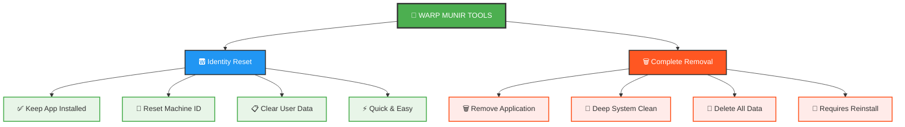
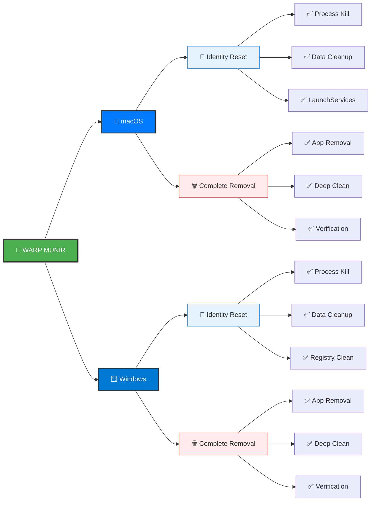
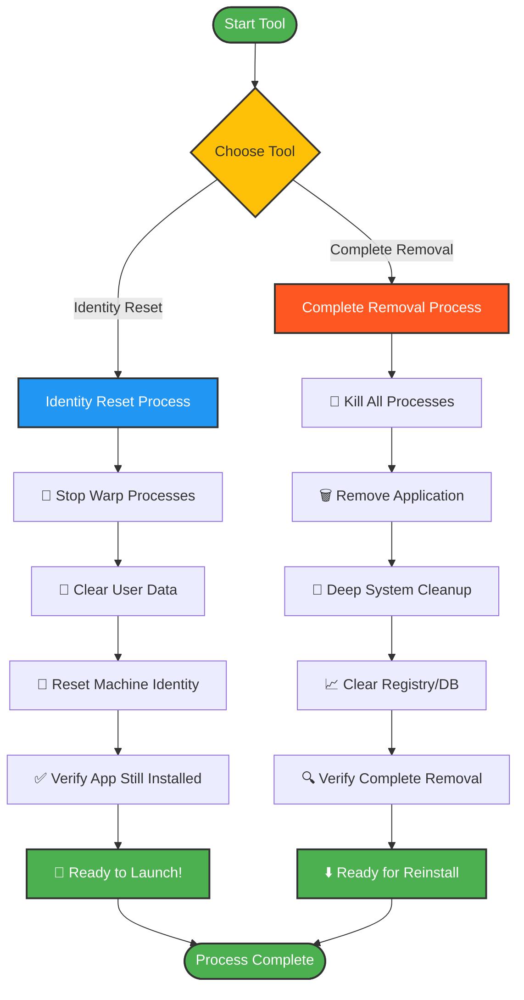
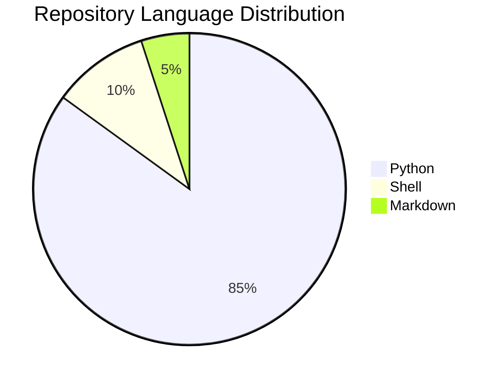

# 🚀 Warp Bypass - Identity Reset & Complete Removal Tools

<div align="center">

<!-- Main Project Badges -->


<!-- Live GitHub Stats -->


<!-- Real-time Analytics -->
[](https://github.com/black12-ag/warp-bypass)


**Cross-platform Python tools for Warp terminal: Reset machine identity OR completely remove the app**

[Tools](#-available-tools) • [Quick Start](#-quick-start) • [Usage](#-usage) • [How it Works](#-how-it-works) • [Contributing](#-contributing)

</div>

---

## 🎯 What is This?

**Warp Bypass** provides two powerful cross-platform tools to reset your Warp terminal identity:

1. **🆆 Identity Reset** - Keeps app installed, resets machine identity
2. **🗑️ Complete Removal** - Completely removes app and all traces

## 🛠️ Available Tools

### 🆆 `warp_id_reset.py` - Identity Reset (Recommended)
**Perfect for bypassing machine limitations while keeping your app!**

- ✅ **Keeps Warp installed** - No need to reinstall
- 🆆 **Resets machine identity** - Appear as a new user/machine
- 📋 **Clears user data** - Fresh start with existing installation
- ⚡ **Fast & convenient** - Ready to use immediately after reset

### 🗑️ `warp_remover.py` - Complete Removal
**For when you want to completely start over from scratch**

- 🗑️ **Removes entire app** - Complete uninstallation
- 🧹 **Deep system cleanup** - Removes all traces
- 🆆 **Fresh machine identity** - Complete reset for reinstalls
- 🔄 **Requires reinstallation** - Need to download and install again

### ⚡ Which Tool Should You Use?

| Scenario | Recommended Tool | Why |
|----------|------------------|-----|
| **Bypass machine limits** | 🆆 Identity Reset | Keeps app, just resets identity |
| **Fix app issues** | 🆆 Identity Reset | Fresh start without reinstalling |
| **Clean slate reinstall** | 🗑️ Complete Removal | Removes everything for fresh install |
| **Troubleshooting** | 🆆 Identity Reset | Faster, easier recovery |

## 📊 Tools Comparison Chart

<div align="center">



</div>

### 🎯 Visual Feature Comparison

<table align="center">
<tr>
<th>Feature</th>
<th>🆆 Identity Reset</th>
<th>🗑️ Complete Removal</th>
</tr>
<tr>
<td><strong>🏗️ App Installation</strong></td>
<td>✅ <strong>Preserved</strong></td>
<td>❌ <strong>Removed</strong></td>
</tr>
<tr>
<td><strong>⚡ Speed</strong></td>
<td>🚀 <strong>Fast</strong> (30-60 sec)</td>
<td>🐌 <strong>Moderate</strong> (2-5 min)</td>
</tr>
<tr>
<td><strong>💾 User Data</strong></td>
<td>🧹 <strong>Cleared</strong></td>
<td>🗑️ <strong>Deleted</strong></td>
</tr>
<tr>
<td><strong>🆔 Machine Identity</strong></td>
<td>🔄 <strong>Reset</strong></td>
<td>🔄 <strong>Reset</strong></td>
</tr>
<tr>
<td><strong>📱 Ready to Use</strong></td>
<td>✅ <strong>Immediately</strong></td>
<td>⬇️ <strong>After Reinstall</strong></td>
</tr>
<tr>
<td><strong>🎯 Best For</strong></td>
<td>🔧 <strong>Quick Fix</strong></td>
<td>🆕 <strong>Fresh Start</strong></td>
</tr>
</table>

### ⚡ Why Use These Tools?

- **Reset machine identity** - Bypass any device-specific limitations
- **Clean slate experience** - Remove problematic configurations
- **Cross-platform compatibility** - Works identically on macOS and Windows
- **Safe operation** - Smart error handling and user confirmations

## ✨ Features

### 🌍 Cross-Platform Support Matrix

<div align="center">



</div>

### 🛠️ Detailed Feature Matrix

| Feature | macOS | Windows | Description |
|---------|-------|---------|-------------|
| 🔫 **Process Termination** | ✅ | ✅ | Safely kills all Warp processes |
| 🗑️ **Application Removal** | ✅ | ✅ | Removes main app from system |
| 📁 **Data Cleanup** | ✅ | ✅ | Clears all user data & preferences |
| 🧹 **Cache Clearing** | ✅ | ✅ | Removes all temporary files |
| 📊 **System DB Cleanup** | ✅ | ✅ | Clears Launch Services/Registry |
| 🔍 **Verification** | ✅ | ✅ | Confirms complete removal |
| 💡 **User-Friendly** | ✅ | ✅ | Progress indicators & emojis |
| ⚠️ **Safe Operation** | ✅ | ✅ | Handles permission errors gracefully |

## 🚀 Quick Start

### Prerequisites
- **Python 3.6+** (usually pre-installed on macOS)
- **Admin privileges** (recommended for complete removal)

### Installation

#### Option 1: Clone Repository
```bash
git clone https://github.com/black12-ag/warp-bypass.git
cd warp-bypass

# Identity Reset (Recommended)
python3 warp_id_reset.py   # macOS
python warp_id_reset.py    # Windows

# OR Complete Removal
python3 warp_remover.py    # macOS  
python warp_remover.py     # Windows
```

#### Option 2: Direct Download
1. Download the tool you need:
   - [`warp_id_reset.py`](warp_id_reset.py) - Identity reset (keeps app)
   - [`warp_remover.py`](warp_remover.py) - Complete removal
2. Run in terminal/command prompt

## 🛠️ Usage

### 🆆 Identity Reset Tool (Recommended)

**macOS:**
```bash
# Make executable (optional)
chmod +x warp_id_reset.py

# Reset identity - keeps Warp installed
python3 warp_id_reset.py
# or
./warp_id_reset.py
```

**Windows:**
```cmd
# For complete reset, run as Administrator (recommended)
# Right-click Command Prompt/PowerShell → "Run as Administrator"

# Reset identity - keeps Warp installed
python warp_id_reset.py
```

### 🗑️ Complete Removal Tool

**macOS:**
```bash
# Make executable (optional)
chmod +x warp_remover.py

# Complete removal
python3 warp_remover.py
# or
./warp_remover.py
```

**Windows:**
```cmd
# For complete removal, run as Administrator:
# Right-click Command Prompt/PowerShell → "Run as Administrator"

# Complete removal
python warp_remover.py
```

## 📚 How It Works

### 🔄 Process Flow Diagram

<div align="center">



</div>

### 🆆 Identity Reset Process (Recommended)

**macOS Identity Reset:**
1. 🔄 Stops Warp processes (keeps app installed)
2. 🔑 Clears user identity data from:
   - `~/Library/Application Support/*warp*` - User data & machine ID
   - `~/Library/Preferences/*warp*` - User preferences & settings
   - `~/Library/Caches/*warp*` - Temporary cache files
   - `~/Library/Logs/*warp*` - Log files with machine info
   - `~/Library/WebKit/*warp*` - Browser data & fingerprints
   - `~/Library/Saved Application State/*warp*` - Session info
   - `~/Library/HTTPStorages/*warp*` - HTTP storage & tokens
3. 📊 Updates Launch Services database
4. ✅ Verifies app is still installed
5. 🆆 Ready to launch with fresh identity!

**Windows Identity Reset:**
1. 🔄 Stops Warp processes (keeps app installed)
2. 🔑 Clears user identity data from:
   - `%LOCALAPPDATA%/*warp*` - User data & machine ID
   - `%APPDATA%/*warp*` - Roaming user settings
   - `%TEMP%/*warp*` - Temporary files with machine info
3. 🔑 Cleans user-specific registry entries
4. ✅ Verifies app is still installed
5. 🆆 Ready to launch with fresh identity!

---

### 🗑️ Complete Removal Process

**macOS Removal:**
1. 🔫 Kills all Warp processes using `pkill`
2. 🗑️ Removes `/Applications/Warp.app`
3. 📁 Cleans all user data from:
   - `~/Library/Application Support/*warp*`
   - `~/Library/Preferences/*warp*`
   - `~/Library/Caches/*warp*`
   - `~/Library/Logs/*warp*`
   - `~/Library/WebKit/*warp*`
   - `~/Library/Saved Application State/*warp*`
   - `~/Library/HTTPStorages/*warp*`
   - `~/Downloads/*warp*`
4. 📊 Clears Launch Services database
5. 🔍 Verifies complete removal

**Windows Removal:**
1. 🔫 Kills all Warp processes using `taskkill`
2. 🗑️ Removes application from Program Files
3. 📁 Cleans all user data from:
   - `%LOCALAPPDATA%/*warp*`
   - `%APPDATA%/*warp*`
   - `%TEMP%/*warp*`
   - `Downloads/*warp*`
4. 🔑 Cleans Windows Registry entries
5. 🔍 Verifies complete removal

## ⚠️ Important Notes

- **Backup first**: This tool permanently deletes files. Back up any important data.
- **Admin privileges**: Run as Administrator (Windows) or with sudo (macOS) for complete removal
- **No undo**: The removal process cannot be reversed
- **Safe execution**: The tool handles permission errors gracefully and won't crash your system

## 🆘 Help & Options

```bash
# Show help
python warp_remover.py --help
```

## 🔧 Troubleshooting

### "Python not found" error:
- **macOS**: Use `python3` instead of `python`
- **Windows**: Install Python from [python.org](https://python.org) or Microsoft Store

### Permission errors:
- **macOS**: Run with `sudo python3 warp_remover.py`
- **Windows**: Run Command Prompt as Administrator

### Registry cleanup fails (Windows):
- Normal behavior without admin privileges
- Run as Administrator for complete registry cleanup

## 🎯 What This Achieves

After running this tool:
- ✅ Your system appears as a **completely new machine** to Warp
- ✅ All machine-specific identifiers are removed
- ✅ You can reinstall Warp with a fresh identity
- ✅ No traces of previous installations remain

## 📸 Screenshots

### macOS Execution
```
🚀 Starting Complete Warp Removal...
💻 Detected system: Darwin
════════════════════════════════════════════════════════════
🔫 Killing Warp processes...
✅ Warp processes terminated
🍎 Removing Warp from macOS...
🗑️ Removing main application...
🗂️ Removed directory: /Applications/Warp.app
📁 Removing user data and configuration...
🗂️ Removed directory: /Users/user/Library/Application Support/warp
📊 Clearing Launch Services database...
🔍 Verifying complete removal...

════════════════════════════════════════════════════════════
✅ WARP REMOVAL COMPLETE!
📈 Removed 15 items
🎉 Perfect! No Warp traces found.
🔄 Your system will now appear as a NEW MACHINE to Warp.
⬇️ You can safely reinstall Warp now.
════════════════════════════════════════════════════════════
```

## 🤝 Contributing

Contributions are welcome! Here's how you can help:

1. **🍴 Fork the repository**
2. **🌟 Create a feature branch**: `git checkout -b feature/amazing-feature`
3. **💾 Commit your changes**: `git commit -m 'Add amazing feature'`
4. **📤 Push to branch**: `git push origin feature/amazing-feature`
5. **🔃 Open a Pull Request**

### 💡 Ideas for Contributions
- Support for Linux distributions
- GUI version of the tool
- Additional verification methods
- Performance optimizations
- Better error handling

## 📄 License

This project is licensed under the MIT License - see the [LICENSE](LICENSE) file for details.

## ⚠️ Disclaimer

This tool is provided "as is" without warranty of any kind. Users are responsible for:
- Creating backups before use
- Understanding the tool's functionality
- Using appropriate system privileges
- Complying with their local laws and Warp's terms of service

## 🙏 Acknowledgments

- Inspired by the need for complete application removal tools
- Built for cross-platform compatibility
- Designed with user safety in mind

## 📞 Support

If you encounter issues:

1. Check the [Troubleshooting](#-troubleshooting) section
2. Search existing [Issues](https://github.com/black12-ag/warp-bypass/issues)
3. Create a new issue with:
   - Your operating system
   - Python version
   - Error message (if any)
   - Steps to reproduce

## 📊 Repository Analytics & Stats

### 🏆 GitHub Performance Metrics

<div align="center">

<!-- Stars and Social Stats -->


<!-- Repository Activity -->


<!-- Code Quality -->


<!-- Download Stats -->


</div>

### 📊 Live Analytics Dashboard

<div align="center">

<!-- GitHub Traffic Stats -->
[](https://github.com/black12-ag/warp-bypass)

<!-- Advanced GitHub Stats -->


</div>

### 📈 Contribution Activity Chart

<div align="center">


**Contributors Graph**


</div>

### 🌐 Language & Code Statistics

<div align="center">

<!-- Language Breakdown -->


<!-- GitHub Language Stats Chart -->


</div>

### 📅 Repository Timeline

<div align="center">

```mermaid
gitgraph
    commit id: "Initial Release"
    commit id: "Identity Reset Tool"
    commit id: "WARP MUNIR Branding"
    commit id: "Visual Charts"
    commit id: "Analytics Dashboard"
```

</div>

### 🏅 Achievement Badges

<div align="center">


</div>

---

<div align="center">

**⭐ If this tool helped you, please give it a star! ⭐**

**Made with ❤️ for the developer community**

</div>
